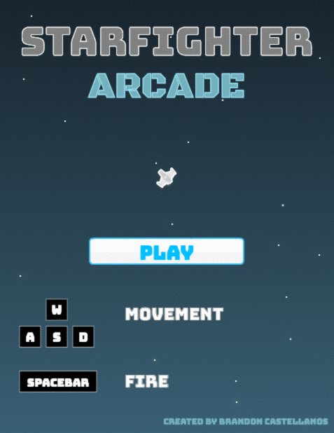
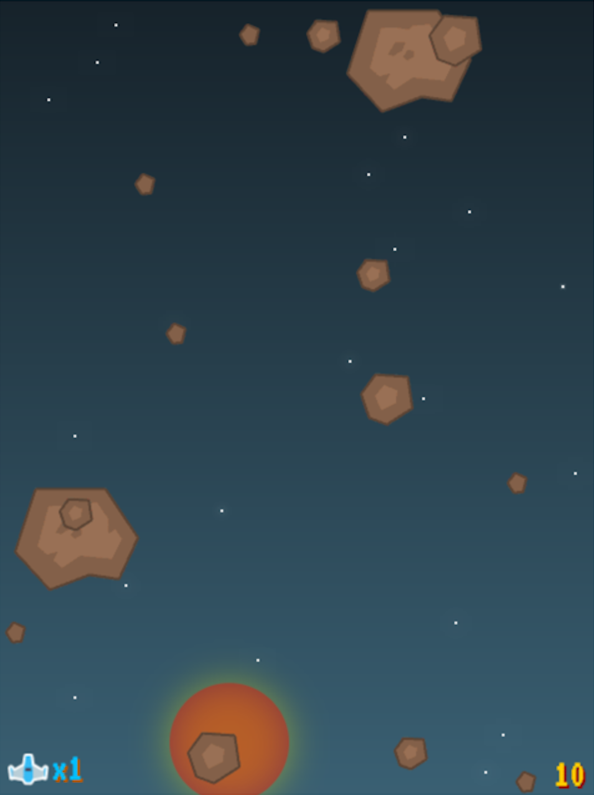
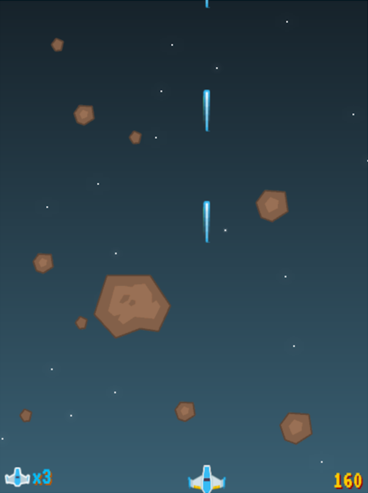
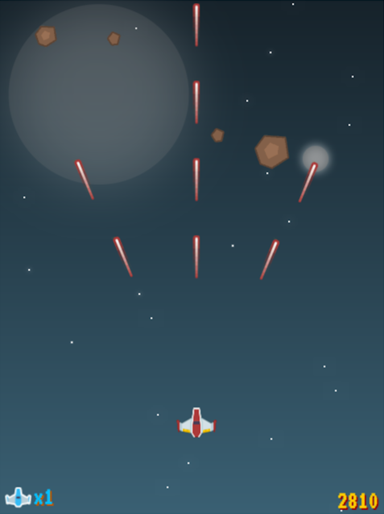

<h1 align="center">
   
  
    
  
</h1>

<h4 align="center">A space shooter built with vanilla JavaScript and HTML5-Canvas.</h4>

<h2 align="center">
  <a href="https://bcastell.github.io/starfighter">PLAY</a>
</h2>

  

## Screenshots
|  |    |
| ----------------------------------------|----------------------------------------- |
| |  |

## Instructions
- Shoot and destroy meteors to increase score
- Dodge incoming meteors to prevent losing lives
- Collect powerups to wreak havoc

## Key Features
* Custom Particle Effects
  - Player death
  - Player revival
  - Meteor explosion
  - Powerups
  - Stars
* Audio
  - Background music
* Powerups
  - Triple-fire
  - Shield
  - Extra life
* Lives
* Score

## Controls

| Action     | Button                       |
|------------|------------------------------|
| Move left  | <kbd>A</kbd> or <kbd>◀︎</kbd> |
| Move right | <kbd>D</kbd> or <kbd>▶︎</kbd> |
| Move up    | <kbd>W</kbd> or <kbd>▲</kbd> |
| Move down  | <kbd>S</kbd> or <kbd>▼</kbd> |
| Fire       | <kbd>Spacebar</kbd>          |

## Authors
* **Brandon Castellanos** - [GitHub](https://github.com/bcastell)

## Attribution
[Jan125](https://opengameart.org/users/jan125) - Background Music

## License
This project is licensed under the MIT License - see the [LICENSE](LICENSE) file for details.
